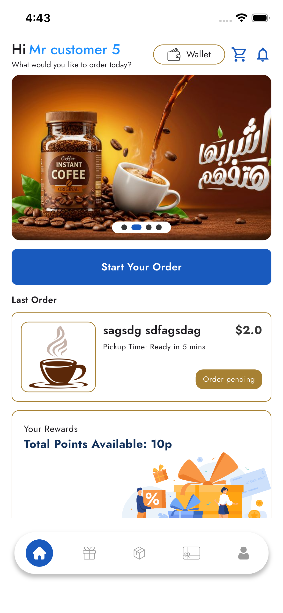
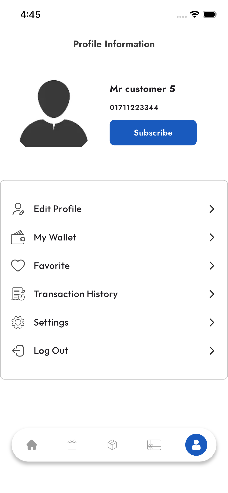
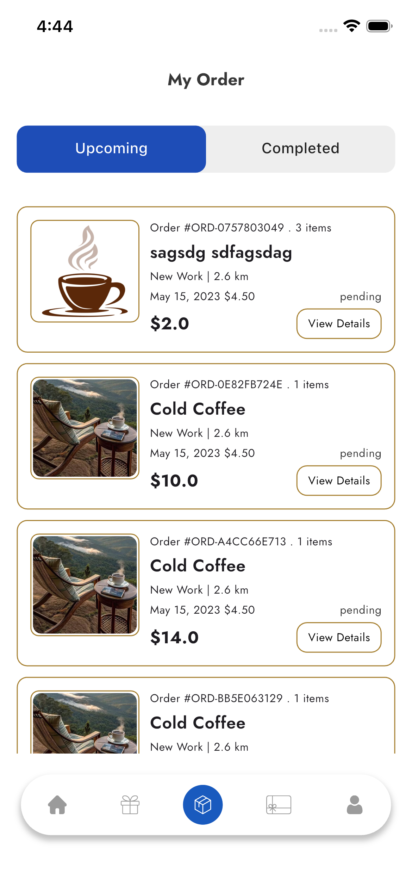
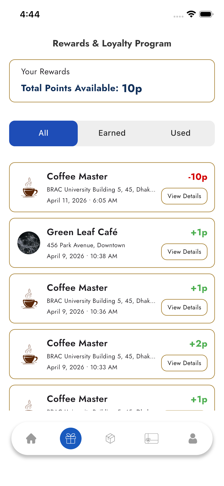
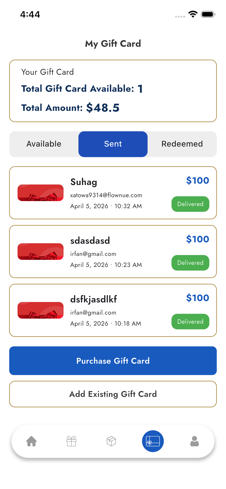
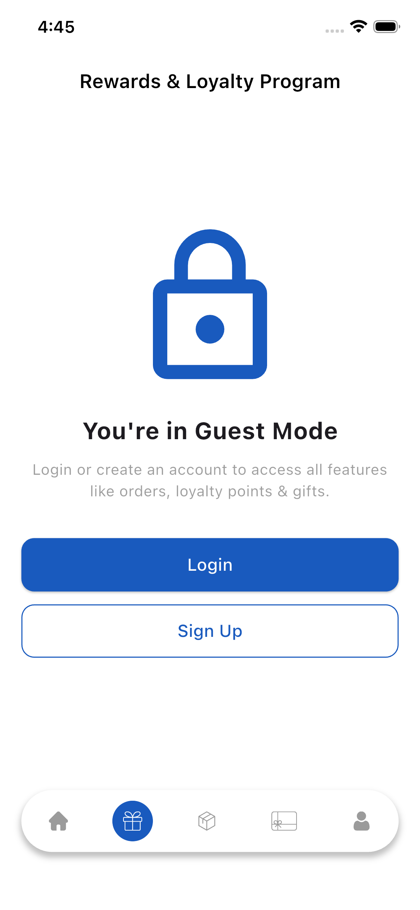
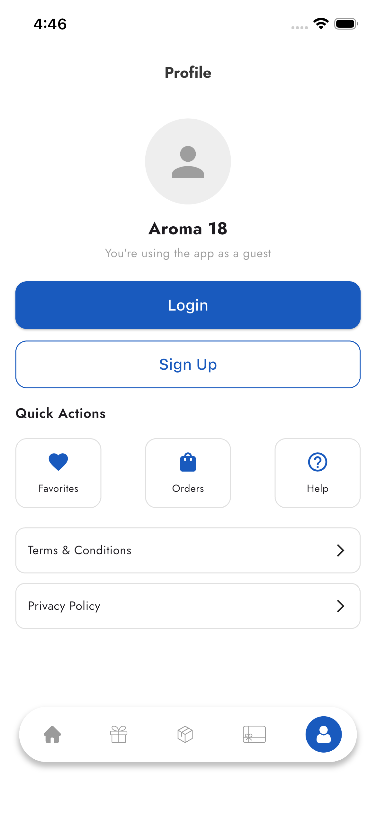

<div align="center">

# COFFECITO

**A Flutter coffee-ordering experience — browse shops, order for pickup, manage your wallet, and earn rewards.**

[](https://flutter.dev)
[](https://dart.dev)
[](https://pub.dev/packages/get)

</div>

---

## Overview

COFFECITO is a cross-platform mobile app for discovering coffee locations, placing orders, and tracking loyalty benefits. The codebase is organized by **feature** with shared **core** modules for routing, networking, theming, and reusable UI.

---

## Features

| Area | Highlights |
|------|------------|
| **Auth & onboarding** | Sign-in, registration, OTP flows, password recovery |
| **Guest mode** | Browse and explore without a full account |
| **Home & discovery** | Shop browsing and entry into the order flow |
| **Orders** | Cart, pickup location, shop details, order history |
| **Wallet & payments** | Wallet UI; checkout flows including **Stripe** via **WebView** |
| **Rewards & gifts** | Reward points, details, and gift card flows |
| **Profile** | Profile editing, favorites, settings, policies, contact |
| **Maps & location** | **Google Maps** integration and location-aware flows |
| **Notifications** | In-app notification center (API-driven) |

---

## Screenshots

<p align="center">
  
  
  
</p>

<p align="center">
  
  
  
</p>

<p align="center">
  
</p>

---

## Demo video

The screen recording is stored in this repository:

- **[`screen_shorts/app_vedio.mov`](./screen_shorts/app_vedio.mov)**

> **Note:** GitHub’s README does not embed `.mov` files inline. Open the file from the repo (or download it) to watch. For an inline preview on the repo homepage, upload an **MP4** to a release or host on YouTube/Vimeo and link it here.

---

## Tech stack

| Layer | Packages & tools |
|--------|------------------|
| **Framework** | Flutter (`sdk: ^3.10.4`) |
| **State & routing** | [get](https://pub.dev/packages/get) (GetX) |
| **Networking** | [dio](https://pub.dev/packages/dio), [pretty_dio_logger](https://pub.dev/packages/pretty_dio_logger) |
| **Persistence** | [get_storage](https://pub.dev/packages/get_storage) |
| **UI** | [flutter_screenutil](https://pub.dev/packages/flutter_screenutil), [google_fonts](https://pub.dev/packages/google_fonts), [cached_network_image](https://pub.dev/packages/cached_network_image), [flutter_svg](https://pub.dev/packages/flutter_svg), [shimmer_animation](https://pub.dev/packages/shimmer_animation) |
| **Maps & location** | [google_maps_flutter](https://pub.dev/packages/google_maps_flutter), [geolocator](https://pub.dev/packages/geolocator), [geocoding](https://pub.dev/packages/geocoding), [permission_handler](https://pub.dev/packages/permission_handler) |
| **Media & Web** | [image_picker](https://pub.dev/packages/image_picker), [webview_flutter](https://pub.dev/packages/webview_flutter), [flutter_html](https://pub.dev/packages/flutter_html) |
| **Splash** | [flutter_native_splash](https://pub.dev/packages/flutter_native_splash) |

---

## Architecture

The app follows a **layered, feature-first** layout:

- **Presentation:** screens, widgets, GetX controllers  
- **Domain:** models, entities, repositories (API contracts)  
- **Core:** shared components, theme, API client, routes, bindings  

Data flow is intentionally straightforward:

```text
UI (widgets) → Controller (GetX) → Repository → Api services (Dio) → Backend
```

---

## Project structure

High-level layout of the repository (Flutter package name: **`coffie`**):

```text
coffie/
├── android/                 # Android host project
├── ios/                     # iOS host project
├── assets/
│   ├── icons/               # App icons & splash assets
│   └── images/              # Raster / illustration assets
├── lib/
│   ├── main.dart            # App entry
│   ├── core/
│   │   ├── component/       # Shared UI (buttons, inputs, images, webview, app bar, …)
│   │   ├── const/           # App-wide constants
│   │   ├── route/           # Routes, bindings, navigation setup
│   │   ├── service/
│   │   │   ├── api_service/ # Dio client, endpoints, auth/non-auth APIs
│   │   │   └── location_service/
│   │   ├── theme/           # Light/dark theming
│   │   └── utils/           # Helpers (logging, formatting, …)
│   └── feature/             # Feature modules (see below)
├── screen_shorts/           # README screenshots & demo video (promo assets)
├── analysis_options.yaml
└── pubspec.yaml
```

### Feature modules (`lib/feature/`)

Each feature typically contains **`domain/`** (models, repositories) and **`presentation/`** (UI, controllers, widgets):

```text
feature/
├── auth/                    # Sign-in, sign-up, OTP, forgot password
├── favorite/                # Favorites data & UI
├── geust/                   # Guest-mode screens (spelling as in codebase)
├── gift_card/               # Gift cards
├── home/                    # Home feed / discovery
├── navigation/              # Bottom navigation shell
├── new_order/               # Cart, products, pickup, shop order flow
├── notification/          # Notification list (authenticated & guest)
├── onboarding/              # Onboarding flow
├── order/                   # Orders list & details
├── profile/                 # Profile, wallet subsection, settings, legal
├── reward/                  # Rewards & details
├── splash/                  # Splash
└── wallet/                  # Wallet balance & cards
```

---

## Getting started

### Prerequisites

- [Flutter SDK](https://docs.flutter.dev/get-started/install) (compatible with `sdk: ^3.10.4` in `pubspec.yaml`)
- Xcode (for iOS) / Android Studio or SDK (for Android)
- Valid **Google Maps** API keys configured in `android/` and `ios/` where required

### Run the app

```bash
git clone <your-repo-url>
cd coffie
flutter pub get
flutter run
```

Configure environment-specific values (API base URL, map keys, etc.) in your core/API configuration before pointing at a production backend.

---

## License

Specify your license in a `LICENSE` file at the repository root if this project is public.

---

<div align="center">

**Built with Flutter**

</div>
